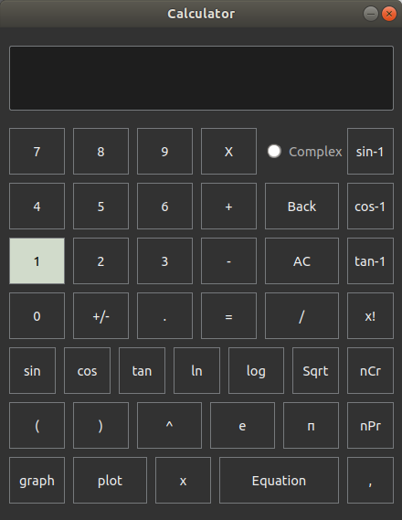
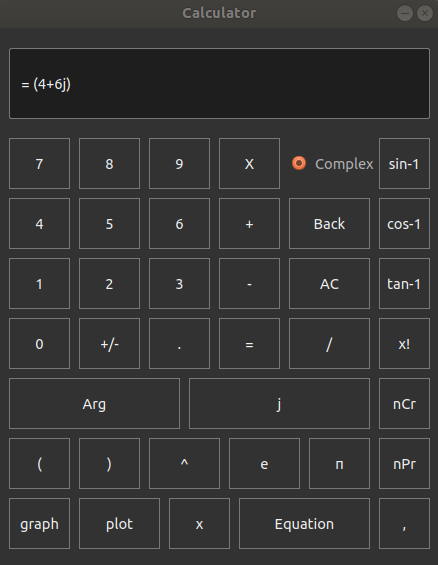
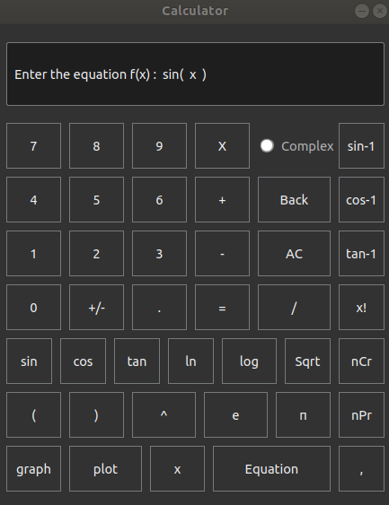
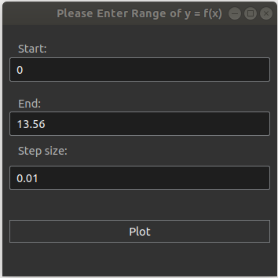
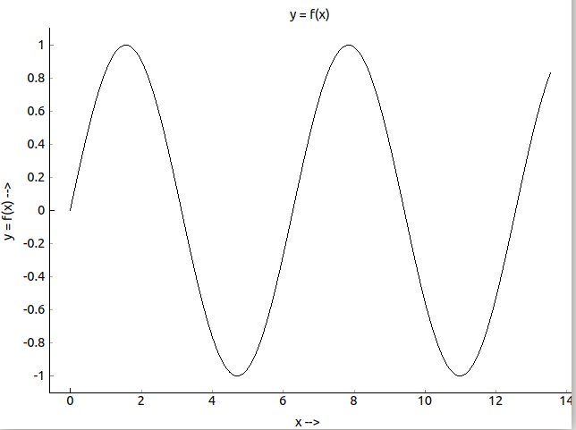

 

 

[![KWoC 2018](https://img.shields.io/badge/KWoC-2018-0078D6.svg?style=for-the-badge&longCache=true&logo=)](https://kwoc.kossiitkgp.org/)

# PyQt Calculator
This is a basic PyQt based scientific calculator.

## Linux based OS

### Prerequisite:

* PyQt4

* Qt Designer (Only for developers for editing layouts)

### Installation:

* PyQt4 can be installed via terminal as `sudo apt-get install python-qt4`

* For UI modification install Qt designer which can be installed as given [here](https://askubuntu.com/questions/763877/how-to-install-and-run-qt-designer-for-python).

## Windows

### Prerequisite:

* SIP

* PyQt4

* Qt Designer (Only for developers for editing layouts)

### Installation:

* Download & install SIP via cmd or powershell as `pip install SIP`.

* For PyQt4 download its wheel file from [here](https://www.lfd.uci.edu/~gohlke/pythonlibs/#pyqt4). Then locate its directory and run
  `pip install .\pyqt4-file-name.whl` in cmd or powershell.
   Note: "pyqt4-file-name" should be the name of wheel file downloaded.
   
* For UI modification download & install Qt designer from [here](https://www.qt.io/download).

## MacOS 

### Prerequisite:

* Homebrew (For easy installation of dependency)

* SIP

* PyQt4

* Qt Designer (Only for developers for editing layouts)

### Installation:

* Download & install [SIP](https://www.riverbankcomputing.com/software/sip/download/).
  Or you can install it via homebrew as `brew install sip`.
  
* For PyQt4 Run `brew install cartr/qt4/pyqt` in homebrew & finally add it to the python path.

* For UI modification download & install Qt designer from [here](https://www.qt.io/download).

## Running Calculator:

* Run `git clone https://github.com/taapas1128/Calculator_pyqt` to clone the repository.

* Run `logic.py` for running the calculator.

## Additional Information

*  `logic.py` contains the basic evaluation code and the logic behind the calculator.

* `calculator.ui` is the UI design used which can be created by PyQt Designer GUI.

* `calculator.py` is extract code of the UI using PyQt.

* You can also go through these set of videos for understanding the framework and functioning of qt designer. Click [here](https://www.youtube.com/watch?v=iDJlGV8Rvgg).

* Using the complex mode :
  There is a button labelled "complex" in the upper right corner of the calculator. Press it to enter the complex mode. Here   you can perform operations on complex numbers. Imaginary numbers are represented in A + Bj format. After giving a proper input you can perform all operations       such as addition, subtraction, multiplication, division and exponents. You can also find argument of the complex number       by pressing the "Arg" button. You can switch back to normal mode by pressing the "complex" button again.

* Using the graph mode :
  The button labelled 'graph' serves the purpose of plotting simple graphs. Pressing it will display a message on the Calculator display screen askng you to enter the equation y = f(x). Please enter the equation in terms of variable 'x' with a button for it located on the lower-right side of the calculator window. After writing in the equation (taking care of parenthesis wherever required), press the 'plot' button next to the graph button. Pressing this will display a pop-up asking you to enter the range of values(start index and end index) over which the graph has to be plotted (For ex. 0 to 2*pi for sin(x). Note : Please enter pi as 3.14), and the step size. A lower step-size (For ex. 0.01 or 0.1) ensures a smoother graph which more closely resembles the desired output. After filling the above 3 text-boxes, in order to display the graph, press Plot on the dialog box.

* Using nCr , nPr and x! buttons :
  Pressing "x!" button will display "factorial(" , for finding factorial of a number "n", syntax is factorial(n). Pressing "nCr" button will display "nCr(" , for finding it the syntax is nCr(n,r). Pressing "nPr" button will display "nPr(" , for finding it the syntax is nPr(n,r). WHERE n and r are standard mathematical notations and have their usual meanings. "," button is available in the lower right corner of the calculator.

* Using the Equation Button :
  Press the "Equation" button in the lower right corner of the calculator and you will be guided to menu window where you have to choose which type of equation you want to solve. For solving linear equation in two variables click on "Solve Linear Equation in two Variable" button and you will get a new pop-up window, fill in the details to get x and y. For Solving Quadratic equation click on "Solve Quadratic equation" button and you will get a new pop-up window , fill in the details to get two roots of the equation.
  
* Here is the Layout of our scientific calculator! 

  
  
  
  
  
## Support:

For any queries, please raise an issue or contact github@taapas1128.
